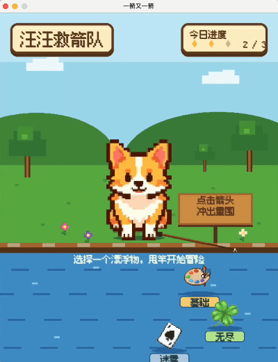
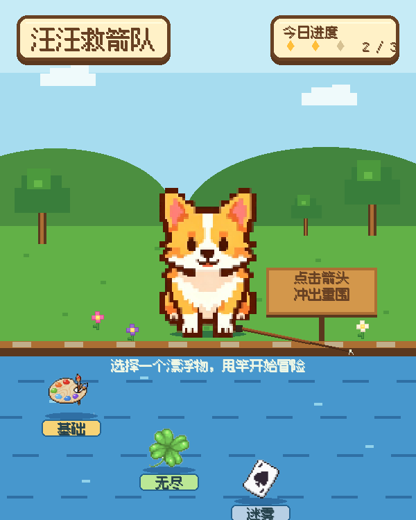
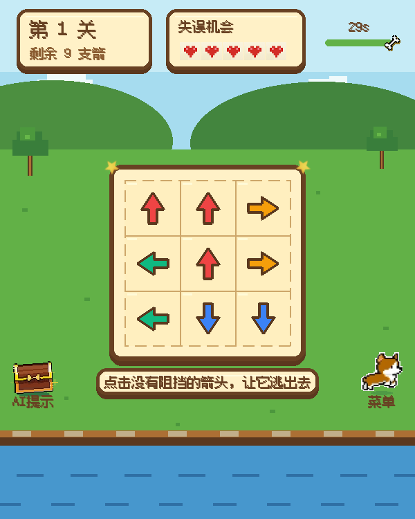
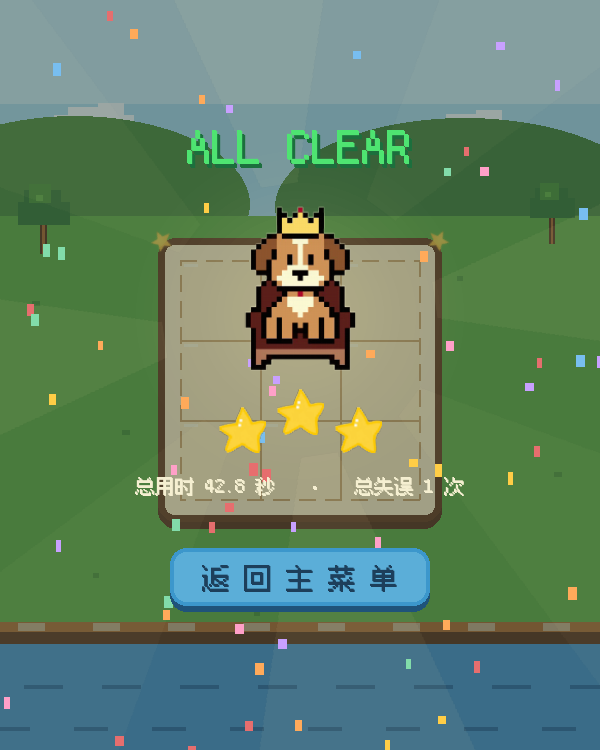
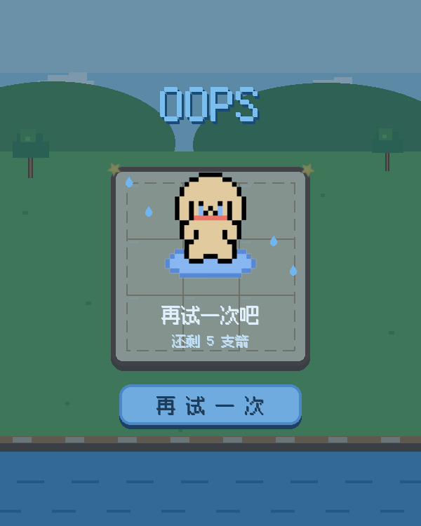

# 汪汪救箭队（Arrow Escape）

一款使用 Python 和 Pygame 开发的像素风箭头消除小游戏。跟着柯基队长观察路线、解开箭阵，让被困在棋盘里的箭头一支接一支逃出去。

玩家需要观察棋盘中每支箭头的方向，依次点击前方没有阻挡的箭头，让它们飞出棋盘。清除全部箭头即可通关；如果点击了被阻挡的箭头，则会消耗一次失误机会。

## 游戏简介

游戏包含三种模式：

- **基础模式**：包含 3 个固定关卡，棋盘依次为 3×3、4×4 和 5×5，适合熟悉规则。
- **无尽模式**：随机生成关卡，棋盘最大为 6×6，箭头生成概率随关卡提高；生成后会自动检查可解性。
- **迷雾模式**：共 10 关，只显示当前剩余箭头所形成区域的动态最外圈；外圈箭头完全飞走后，边界向内收缩并显示下一层。显现规则与上下左右相邻的空位数量无关。

主要功能包括：

- 箭头路径阻挡检测；
- 蓄力、加速飞行、拖尾和碰撞晃动动画；
- 五次失误机会、关卡倒计时和死锁检测；
- 重新开始、返回菜单和 AI 安全箭头提示；
- 根据通关时间和失误次数计算 1～3 星评价；
- 像素风菜单、钓鱼模式选择、自定义柯基光标；
- 背景音乐及甩竿、提示、失误和通关音效。

## 游戏演示

### 钓鱼选择模式

开始界面把三个模式设计成水面上的可钓物品。点击目标后，柯基会完成甩竿和收线动画，再显示对应模式的规则。



### 基础模式

基础模式包含 3 个固定关卡。玩家需要从当前没有阻挡的箭头开始，逐步打开后续路线。


### 无尽模式

无尽模式会持续生成经过可解性检查的随机关卡。随着关卡推进，棋盘逐步扩大，箭头生成概率也会提高。


### 迷雾模式

迷雾模式仅显示当前箭阵的动态最外圈，内部箭头由问号遮挡。外层箭头进入 `dead` 状态后，下一层才会显现。


### 失败与重新挑战

失误次数耗尽、倒计时结束或棋盘陷入死锁时会进入失败界面，可以立即重新挑战当前关卡。


## 开发环境

- Python 3.12.7
- Pygame 2.6.1
- macOS

程序主体位于 `main.py`，图片、字体和音频资源位于 `assets/`。

> 当前版本在 macOS 上开发和测试，背景音乐使用系统自带的 `afplay`，退出时还会调用 POSIX 进程清理接口。Windows 和 Linux 尚未完整适配；如需跨平台运行，应将 BGM 播放与进程清理部分替换为 Pygame Mixer 等跨平台实现。

## 安装和运行

### 1. 获取项目

```bash
git clone https://github.com/lllee9033-lab/arrow-escape.git
cd arrow-escape
```

也可以直接下载项目压缩包并解压，然后在项目目录中打开终端。

### 2. 创建虚拟环境（推荐）

```bash
python3 -m venv .venv
source .venv/bin/activate
```

Windows PowerShell 使用：

```powershell
python -m venv .venv
.venv\Scripts\Activate.ps1
```

### 3. 安装依赖

```bash
python3 -m pip install pygame==2.6.1
```

### 4. 启动游戏

```bash
python3 main.py
```

如果已经完成跨平台音频适配，Windows 环境可根据 Python 的安装方式将命令中的 `python3` 改为 `python`。

## 游戏操作说明

### 选择模式

在开始界面使用鼠标点击水面上的物品：

| 物品 | 游戏模式 |
| :---: | :--- |
| 调色盘 | 基础模式 |
| 四叶草 | 无尽模式 |
| 问号卡片 | 迷雾模式 |

钓起物品并查看规则后，点击“开始挑战”进入游戏。

### 消除箭头

1. 观察箭头的朝向。
2. 判断箭头前方是否还有其他未消除的箭头。
3. 使用鼠标左键点击前方无阻挡的箭头。
4. 安全箭头会沿自身方向飞出棋盘；受阻箭头会原地晃动，并扣除一次失误机会。
5. 清除本关全部箭头后进入通关结算。

方向标记含义：

| 标记 | 方向 |
| :---: | :---: |
| `U` | 上 |
| `D` | 下 |
| `L` | 左 |
| `R` | 右 |

### 其他操作

- 点击左下角的 **AI 提示宝箱**，可高亮一支当前能够安全消除的箭头。
- 点击右下角的 **柯基菜单按钮**，可返回主菜单。
- 点击右上角的 **倒计时区域**，可重新开始当前关卡。
- 失误次数耗尽、倒计时结束或出现死锁时，点击“再试一次”重新挑战。
- 通关后点击“继续冒险”进入下一关。

## 游戏截图

### 开始界面



### 游戏过程



### 总通关界面



### 失败界面



## 项目结构

```text
arrow-escape/
├── main.py             # 游戏主程序
├── assets/             # 图片、字体、背景音乐和交互音效
├── blog-assets/        # README 与博客使用的截图和演示 GIF
└── README.md
```
